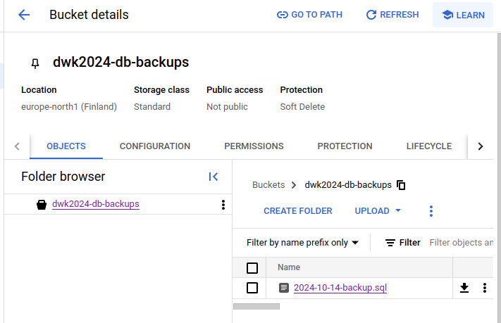

# Part 3

- Started free trial with Google Cloud, started new project and installed gcloud
- Created new cluster: 

```bash 
$ gcloud container clusters create dwk-cluster --zone=europe-north1-b --cluster-version=1.30

$ sudo apt install google-cloud-cli-gke-gcloud-auth-plugin
```

Delete the cluster with:

```bash
gcloud container clusters delete dwk-cluster --zone=europe-north1-b 
```

## Exercise 3.01: Pingpong GKE

[Manifests](e_3.01/)

- Removed storageClass from the volumeClaimTemplate
- Added subPath to configuration
- Using LoadBalancer to expose the service

```bash
$ kubectl get svc --watch
NAME            TYPE           CLUSTER-IP       EXTERNAL-IP   PORT(S)        AGE
kubernetes      ClusterIP      34.118.224.1     <none>        443/TCP        4d19h
ping-pong-svc   LoadBalancer   34.118.235.199   <pending>     80:30115/TCP   31s
postgres-svc    ClusterIP      None             <none>        5432/TCP       73s
ping-pong-svc   LoadBalancer   34.118.235.199   34.88.127.25   80:30115/TCP   38s

$ curl 34.88.127.25/pingpong
pong 10
```

## Exercise 3.02: Back to Ingress

[Manifests](e_3.02/)

- Deployed log and pingpong apps to GKE
- Changed the communication between log and pingpong to use json
- Services are exposed with Ingress

```bash
$ curl http://34.144.230.54/
file content: This is text from file
<br>env variable: MESSAGE=Hello Wörld<br>2024-10-08 10:43:23.665 +0000 51ac1a7b-46e6-45a9-a2f1-3f9843084874<br>Ping / Pongs: 35

$ curl http://34.144.230.54/pingpong
pong 36
```

## Exercise 3.03: Project v1.4

[yamls](e_3.03/)

- Created service account here: [https://console.cloud.google.com/iam-admin/serviceaccounts/](https://console.cloud.google.com/iam-admin/serviceaccounts/) with required roles
- Created GKE_SA_KEY and added it to GitHub secrets
- Created Docker repository Google Cloud
- Moved todo-app and todo-backend under todo directory
- kustomization.yaml, ingress.yaml and secret.enc.yaml under todo. All the app specific manifests under todo-app/manifests, same for backend.
- Created [Pipeline](e_3.03/pipeline/todo-pipeline.yaml) that builds and pushes app and backend to GCR, decrypts secret and runs Kustomize to deploy project
- Made some changes to project for it to work.

## Exercise 3.04: Project v1.4.1

- Created new branch `$ git switch -c e-3-04`
- Changed the page title from Home Page to Todo App

```bash
$ kubens default
Context "gke_dwk2024_europe-north1-b_dwk-cluster" modified.
Active namespace is "default".

$ kubectl get ing
NAME               CLASS    HOSTS   ADDRESS         PORTS   AGE
dwk-todo-ingress   <none>   *       34.144.230.54   80      93m

$ kubens e-3-04 
Context "gke_dwk2024_europe-north1-b_dwk-cluster" modified.
Active namespace is "e-3-04".

$ kubectl get ing
NAME               CLASS    HOSTS   ADDRESS         PORTS   AGE
dwk-todo-ingress   <none>   *       34.110.172.16   80      8m3s


k$ curl http://34.110.172.16/ | grep -o '<title>.*</title>'
  % Total    % Received % Xferd  Average Speed   Time    Time     Time  Current
                                 Dload  Upload   Total   Spent    Left  Speed
100  1208    0  1208    0     0   141k      0 --:--:-- --:--:-- --:--:--  147k
<title>Todo App</title>

$ curl http://34.144.230.54/ | grep -o '<title>.*</title>'
  % Total    % Received % Xferd  Average Speed   Time    Time     Time  Current
                                 Dload  Upload   Total   Spent    Left  Speed
100  1209    0  1209    0     0   141k      0 --:--:-- --:--:-- --:--:--  147k
<title>Home Page</title>

```

## Exercise 3.05: Project v1.4.2

[yamls](e_3.05/)

- Modified pipeline yaml to work with pull requests
- Created workflow that deletes namespace when branch is deleted from github

## Exercise 3.06: DBaas vs DIY

[Project](../todo/)

## Exercise 3.07: Backup

- Created [docker image](e_3.07/Dockerfile) for cronjob
- Added service account secret with kubectl
```bash
$ kubectl create secret generic gcs-key --from-file=GKE_SA_KEY_secret.json
secret/gcs-key created
```
- Added [cronjob](e_3.07/backup-cronjob.yaml)
```bash
$ kubectl apply -f part3/e_3.07/backup-cronjob.yaml 
cronjob.batch/backup created
```
- Ran the job manually to test it
```bash
...
pg_dump: creating CONSTRAINT "public.todos todos_pkey"
Updated property [core/account].
Activated service account credentials for: [dwk-part-3@dwk2024.iam.gserviceaccount.com]
Copying file:///backups/2024-10-14-backup.sql to gs://dwk2024-db-backups/2024-10-14-backup.sql
2024-10-14T09:10:49.563962507Z
...
Done
```

