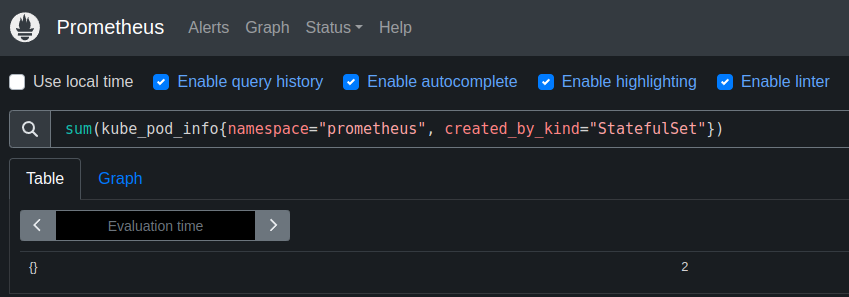
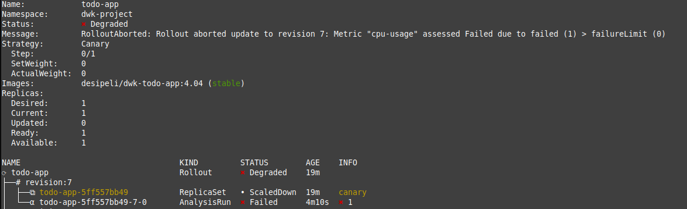

# Part 4

## Exercise 4.01: Readiness Probe

When database is not applied

```bash
$ kubectl get po
NAME                            READY   STATUS    RESTARTS   AGE
logpod-dep-6456bbc548-2n65f     1/2     Running   0          22m
ping-pong-dep-b4fb67ff7-98f7x   0/1     Running   0          22m
```

```bash
$ kubectl describe pod ping-pong-dep-b4fb67ff7-98f7x
...
Events:
  Type     Reason     Age                   From               Message
  ----     ------     ----                  ----               -------
  Normal   Scheduled  23m                   default-scheduler  Successfully assigned default/ping-pong-dep-b4fb67ff7-98f7x to k3d-k3s-default-server-0
  Normal   Pulling    23m                   kubelet            Pulling image "desipeli/dwk-pingpong:4.01"
  Normal   Pulled     23m                   kubelet            Successfully pulled image "desipeli/dwk-pingpong:4.01" in 859ms (859ms including waiting). Image size: 10422254 bytes.
  Normal   Created    23m                   kubelet            Created container ping-pong
  Normal   Started    23m                   kubelet            Started container ping-pong
  Warning  Unhealthy  3m4s (x255 over 22m)  kubelet            Readiness probe failed: HTTP probe failed with statuscode: 500
```

After database is applied

```bash
$ kubectl get po
NAME                            READY   STATUS    RESTARTS   AGE
logpod-dep-6456bbc548-2n65f     2/2     Running   0          25m
ping-pong-dep-b4fb67ff7-98f7x   1/1     Running   0          25m
postgres-stset-0                1/1     Running   0          16s
```

## Exercise 4.02: Project v1.7

With incorrect database credentials and URL

```bash
$ kubectl get po
NAME                            READY   STATUS    RESTARTS      AGE
todo-app-547f68c9bb-dwjt8       0/1     Running   1 (9s ago)    50s
todo-backend-6786b5488d-h5f9v   0/1     Running   1 (14s ago)   50s
todo-postgres-stset-0           1/1     Running   0             50s

$ kubectl get events | grep Unhealthy
89s         Warning   Unhealthy           pod/todo-app-547f68c9bb-dwjt8        Readiness probe failed: HTTP probe failed with statuscode: 500
84s         Warning   Unhealthy           pod/todo-app-547f68c9bb-dwjt8        Liveness probe failed: HTTP probe failed with statuscode: 500
114s        Warning   Unhealthy           pod/todo-app-547f68c9bb-dwjt8        Readiness probe failed: Get "http://10.42.0.153:8000/healthz": EOF
114s        Warning   Unhealthy           pod/todo-app-547f68c9bb-dwjt8        Readiness probe failed: Get "http://10.42.0.153:8000/healthz": dial tcp 10.42.0.153:8000: connect: connection refused
94s         Warning   Unhealthy           pod/todo-backend-6786b5488d-h5f9v    Readiness probe failed: HTTP probe failed with statuscode: 500
89s         Warning   Unhealthy           pod/todo-backend-6786b5488d-h5f9v    Liveness probe failed: HTTP probe failed with statuscode: 500

$ kubectl apply -k part4/e_4.02/
...

$ kubectl get pod
NAME                            READY   STATUS    RESTARTS      AGE
todo-app-547f68c9bb-dwjt8       1/1     Running   5 (76s ago)   4m17s
todo-backend-6786b5488d-h5f9v   1/1     Running   5 (81s ago)   4m17s
todo-postgres-stset-0           1/1     Running   0             4m17s
```

## Exercise 4.03: Prometheus

```
sum(kube_pod_info{namespace="prometheus", created_by_kind="StatefulSet"})
```



## Exercise 4.04: Project v1.8

[manifests](e_4.04/)

```bash
kubectl create namespace argo-rollouts
kubectl apply -n argo-rollouts -f https://github.com/argoproj/argo-rollouts/releases/latest/download/install.yaml

```

Argo Rollouts plugin

```bash
$ curl -LO https://github.com/argoproj/argo-rollouts/releases/latest/download/kubectl-argo-rollouts-linux-amd64

$ chmod +x ./kubectl-argo-rollouts-linux-amd64

$ sudo mv ./kubectl-argo-rollouts-linux-amd64 /usr/local/bin/kubectl-argo-rollouts
```

Cpu usage limit set to 0.2 works well


If the limit is set too low (0.001), the update fails and rolls back to previous



## Exercise 4.05: Project v1.9

[manifests](e_4.05/)

- I changed the app to use json to transfer data
- Added done field to database
- Todos can be set to done

## Exercise 4.06: Project v2.0

- Install nats `helm install --set auth.enabled=false my-nats oci://registry-1.docker.io/bitnamicharts/nats`
- Web service `kubectl port-forward my-nats-0 8222:8222`
- Enable metrics `helm upgrade --set metrics.enabled=true,auth.enabled=false my-nats oci://registry-1.docker.io/bitnamicharts/nats`
- Connect to exported `kubectl port-forward --namespace dwk-project svc/my-nats-metrics 7777:7777`
- Configure serviceMonitor `helm upgrade -f valuesnats.yaml my-nats oci://registry-1.docker.io/bitnamicharts/nats`
- Label for prometheus configuration `kubectl label servicemonitors.monitoring.coreos.com -n prometheus my-nats-metrics release=kube-prometheus-stack-1727939963`


- Created new go project called broadcaster
- Installed [nats go client](https://github.com/nats-io/nats.go)
- Created Webhook for a discord server. Url is in the `secret.enc.yaml` file.

There are two different subjects: `new_todo` and `todo_done`. Todo backend publishes messages when new todos are created or a todo is done. Broadcaster app subscribes to the subjects, and sends messages to discord channel using webhooks.

