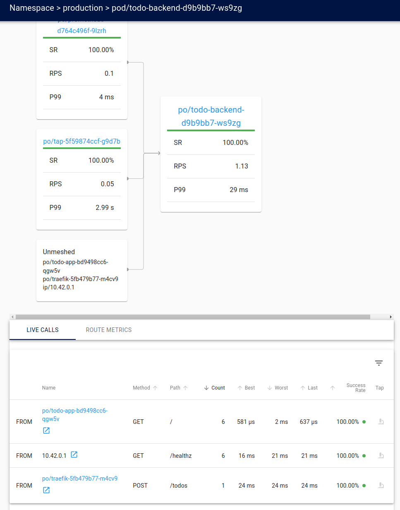
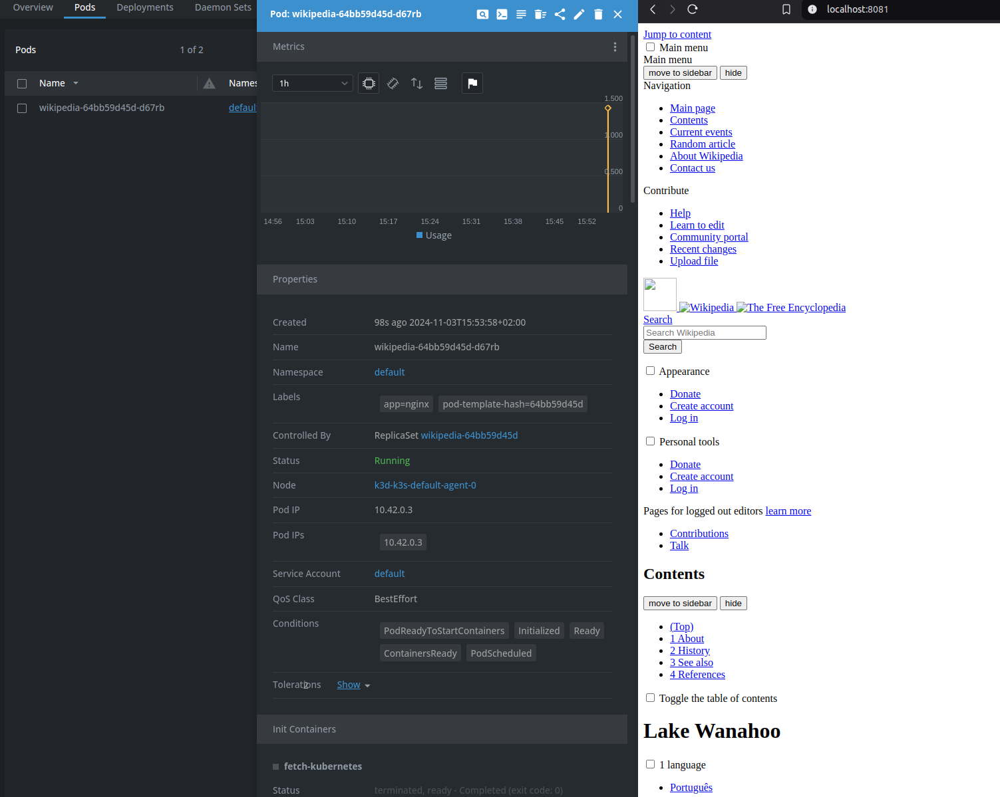

# Part 5

## Exercise 5.01: DIY CRD & Controller

- Installed [kubebuilder](https://book.kubebuilder.io/)

```bash
curl -L -o kubebuilder "https://go.kubebuilder.io/dl/latest/$(go env GOOS)/$(go env GOARCH)"
chmod +x kubebuilder && sudo mv kubebuilder /usr/local/bin/
```

- Created new Go project and ran kubebuilder

```bash
$ kubectl apply -f resourcedefenition.yaml
$ kubectl apply -f dummysite.yaml

$ mkdir dummy-controller
$ cd dummy-controller
$ go mod init dummy.dwk

$ kubebuilder init --domain dummy.dwk


$ kubebuilder create api --group dummy.dwk --version v1 --kind DummySite
INFO Create Resource [y/n]                        
y
INFO Create Controller [y/n]                      
y
```

- Added Url string `json:"url"` to [dummysite_controller.go](e_5.01/dummy-controller/api/v1/dummysite_types.go)
- Controller logic in [dummysite-controller.go](e_5.01/dummy-controller/internal/controller/dummysite_controller.go)
- changed port from the cmd/main.go from 8081 to 8084

```bash
$ make manifests
$ make install

$ make run SERVER_PORT=8085
```

- Changed the api of dummysite.yaml from `apiVersion: dummy.dwk/v1` to `apiVersion: dummy.dwk.dummy.dwk/v1`, because kubebuilder added domain.
- `$ make docker-build docker-push IMG=desipeli/dwk-dummy:1.3`

Run with: `kubectl apply -f ./dummy-manifests`


## Exercise 5.02: Project, the Service Mesh Edition

- Had to add `config.linkerd.io/skip-outbound-ports: "4222"` annotation to backend and broadcaster.

[manifests](e_5.02/manifests/production/)



## Exercise 5.03: Learn from external material

[script](e_5.03/script)

## Exercise 5.04: Wikipedia with init and sidecar

[manifests](e_5.04/)

- For some reason nginx displays 404 sometimes...




## Exercise 5.05: Platform comparison, Rancher and OpenShift

### OpenShift

- Self or fully managed service
- Includes Red Hats enhancements to Kubernetes
- Includes everything needed for development lifecycle: ci/cd, environments...
- Preinstalled and configured monitoring stack
- Security monitoring everywhere
- Cli and browser based web console to manage and visualize
- Run and manage also virtual machine workloads
- Central authentication and authorization
- Built-in container image registry
- Marketplace with add-ons 

Openshift seems to be more opinionated, and is probably easier to get running because of that. However, there is a risk of vendor lock in.

### Rancher

- Open source
- Centralized authentication, access control and observability
- For bare metal, private and public clouds
- app library
- audit logging and rate-limiting
- Simplifies Kubernetes
- Can manage clusters even if they are not created with Rancher
- No risk of vendor lock in

100% open source and no risk of vendor lock in (based on their site). Integrates other open source projects to enhance Kubernetes.

### Which is better?

For small organization Rancher, because it is open source, community version is free and no risk of vendor lock in.

## Exercise 5.06: Trying Serverless

Deleted the current cluster and created new one

```bash
$ k3d cluster create --port 8082:30080@agent:0 -p 8081:80@loadbalancer --agents 2 --k3s-arg "--disable=traefik@server:0"
```

After Knative installation steps

```bash
$ kubectl get pods -n knative-serving
NAME                                      READY   STATUS    RESTARTS   AGE
activator-794bf4b5f-jm4hq                 1/1     Running   0          52s
autoscaler-678cd4b756-sklzl               1/1     Running   0          52s
controller-749fb7bc8b-lwppf               1/1     Running   0          52s
net-kourier-controller-6c6b48b764-78ctj   1/1     Running   0          24s
webhook-7c7d966789-g4pmn                  1/1     Running   0          52s
```

### Deploying a Knative Service from [yaml](e_5.06/knative-service.yaml)

[Knative service](e_5.06/knative-service.yaml)

```bash
$ kubectl apply -f e_5.06/
Warning: Kubernetes default value is insecure, Knative may default this to secure in a future release: spec.template.spec.containers[0].securityContext.allowPrivilegeEscalation, spec.template.spec.containers[0].securityContext.capabilities, spec.template.spec.containers[0].securityContext.runAsNonRoot, spec.template.spec.containers[0].securityContext.seccompProfile
service.serving.knative.dev/hello created

$ kubectl patch configmap/config-domain \
      --namespace knative-serving \
      --type merge \
      --patch '{"data":{"example.com":""}}'

$ kubectl get ksvc
NAME    URL                                LATESTCREATED   LATESTREADY   READY   REASON
hello   http://hello.default.example.com   hello-00001     hello-00001   True

$ curl -H "Host: hello.default.example.com" http://localhost:8081
Hello World!
```

### Autoscaling

```bash
$ kubectl get pod -l serving.knative.dev/service=hello -w
NAME                                     READY   STATUS    RESTARTS   AGE
hello-00001-deployment-5f84fb867-j242w   0/2     Pending   0          0s
hello-00001-deployment-5f84fb867-j242w   0/2     Pending   0          0s
hello-00001-deployment-5f84fb867-j242w   0/2     ContainerCreating   0          0s
hello-00001-deployment-5f84fb867-j242w   1/2     Running             0          1s
hello-00001-deployment-5f84fb867-j242w   2/2     Running             0          1s
hello-00001-deployment-5f84fb867-j242w   2/2     Terminating         0          68s
hello-00001-deployment-5f84fb867-j242w   1/2     Terminating         0          90s
```

### Traffic splitting

```bash
$ curl -H "Host: hello.default.example.com" http://localhost:8081
Hello Knative!

$ kn revisions list
NAME          SERVICE   TRAFFIC   TAGS   GENERATION   AGE     CONDITIONS   READY   REASON
hello-00002   hello     100%             2            6m23s   3 OK / 4     True    
hello-00001   hello                      1            29m     3 OK / 4     True 

# After adding traffic rules

$ kn revisions list
NAME          SERVICE   TRAFFIC   TAGS   GENERATION   AGE     CONDITIONS   READY   REASON
hello-00002   hello     50%              2            5m36s   3 OK / 4     True    
hello-00001   hello     50%              1            28m     3 OK / 4     True 

$ curl -H "Host: hello.default.example.com" http://localhost:8081
Hello Knative!
$ curl -H "Host: hello.default.example.com" http://localhost:8081
Hello World!
$ curl -H "Host: hello.default.example.com" http://localhost:8081
Hello World!
```