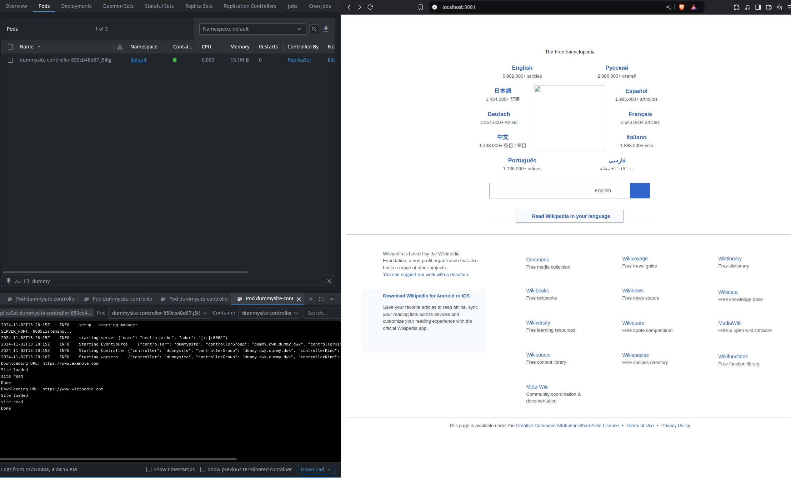

# Part 5

## Exercise 5.01: DIY CRD & Controller

- Installed [kubebuilder](https://book.kubebuilder.io/)

```bash
curl -L -o kubebuilder "https://go.kubebuilder.io/dl/latest/$(go env GOOS)/$(go env GOARCH)"
chmod +x kubebuilder && sudo mv kubebuilder /usr/local/bin/
```

- Created new Go project and ran kubebuilder

```bash
$ kubectl apply -f resourcedefenition.yaml
$ kubectl apply -f dummysite.yaml

$ mkdir dummy-controller
$ cd dummy-controller
$ go mod init dummy.dwk

$ kubebuilder init --domain dummy.dwk


$ kubebuilder create api --group dummy.dwk --version v1 --kind DummySite
INFO Create Resource [y/n]                        
y
INFO Create Controller [y/n]                      
y
```

- Added Url string `json:"url"` to [dummysite_controller.go](e_5.01/dummy-controller/api/v1/dummysite_types.go)
- Controller logic in [dummysite-controller.go](e_5.01/dummy-controller/internal/controller/dummysite_controller.go)
- changed port from the cmd/main.go from 8081 to 8084

```bash
$ make manifests
$ make install

$ make run SERVER_PORT=8085
```

- Changed the api of dummysite.yaml from `apiVersion: dummy.dwk/v1` to `apiVersion: dummy.dwk.dummy.dwk/v1`, because kubebuilder added domain.
- `$ make docker-build docker-push IMG=desipeli/dwk-dummy:1.3`

Run with: `kubectl apply -f ./dummy-manifests`



